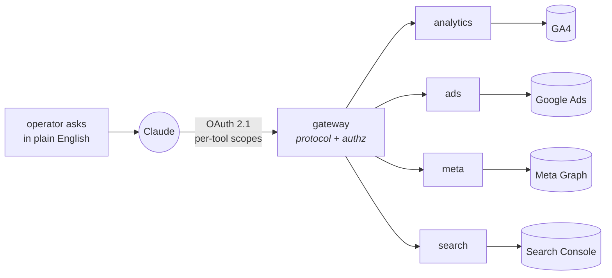

<picture>
  <source media="(prefers-color-scheme: dark)" srcset="https://raw.githubusercontent.com/estrellajm/estrellajm/master/assets/banner-dark.svg">
  <source media="(prefers-color-scheme: light)" srcset="https://raw.githubusercontent.com/estrellajm/estrellajm/master/assets/banner-light.svg">
  
</picture>

 

Full-stack engineer in Denver, CO. I ship the thing that was asked for — then go
looking for the pattern underneath it and build the primitive that makes the next
ten requests trivial.

I work best as a team of one: idea, design, backend, frontend, infrastructure, and
the operational care and feeding afterward.

---

### The shape of most of my work

A request came in: *let an LLM read the production database.* One service, done.
Then the second upstream API arrived, and it wanted the same auth, the same
transport, the same tool plumbing — all of it copied. So I stopped adding services
and split the problem instead: a **gateway** that owns the protocol and per-tool
authorization, and a **one-page HTTP contract** that any downstream service can
satisfy.

Everything after the first one was a recipe, not a project. The OAuth 2.1 layer
came out as an installable package. The people using it aren't engineers — they ask
a question and get an answer out of production data, analytics, and ad spend.

---

### Shipped and running

**HireMyMotorhome** — a motorhome rental marketplace I designed, built, and still
operate on my own. Angular front end, NestJS services, Firestore, Cloud Run. Booking
and payments, host onboarding, fleet and compliance tracking, the analytics pipeline,
the ad tooling, and the deploy process that puts it in production. Real listings,
real bookings, real payouts, one person, still running.

---

### Things I've built

**AI Access Gateway** — a control plane that decides what an assistant, agent, or
automation may do with a client's systems, and produces the evidence that it did only
that. Every client gets its own credentials, policies, salt, audit chain, and
deployment identity, so no single trust domain holds the whole book of business.

**MCP gateway + forwarders** — the diagram above, running in production across four
Cloud Run services against GA4, Google Ads, Meta Graph, and Search Console. Stateless
transport, per-tool scope enforcement, and upstream credentials that ride in
per-request headers rather than in any service's identity, so no forwarder holds
standing access to anything.

**Bankfyn** — a white-label, multi-tenant credit card application platform for banks.
One codebase, many institutions, each with its own branding, rules, and data boundary.

**Slipstream** — a low-latency engine that streams X-Plane 12 from an Apple Silicon Mac
to a Meta Quest 3 with full 6DOF head tracking. Lean forward to read the gauges, look
around the glareshield. (Monoscopic — X-Plane's stereo API is Windows-only, and the
README says so rather than pretending otherwise.)

**Vector** — a Tauri desktop copilot that listens to live sales calls, transcribes
them, and surfaces what matters while the call is still happening.

**unreal-mcp** — a layer over Epic's in-editor MCP server that lets a technical artist
drive Unreal Engine 5.8 from Claude: build it, see it, and get told when the screenshot
doesn't prove what you thought it proved.

<b>What I reach for</b>

 

**Languages** — TypeScript, Python, C++, JavaScript, Swift
**Front end** — React, Angular, signals-first state
**Back end** — Node, NestJS, Express, FastAPI
**Infra** — GCP (Cloud Run, Firestore, Secret Manager), Docker, Cloud Build
**Protocols** — Model Context Protocol, OAuth 2.1 / OIDC, PKCE, JWT
**Other** — real-time video streaming, 6DOF head tracking, X-Plane XPLM SDK,
Unreal Engine, USB/serial hardware bridges

---

Denver, CO · <a href="https://twitter.com/estrellajosem">twitter</a>
