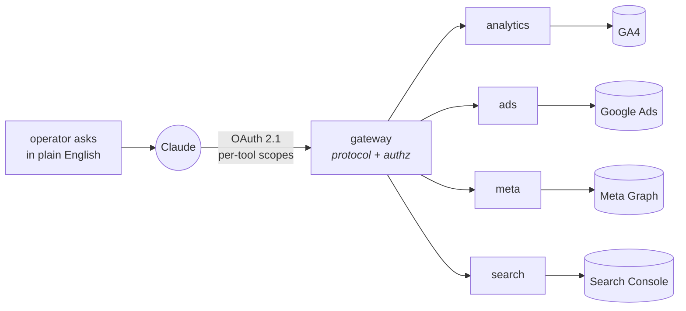

<picture>
  <source media="(prefers-color-scheme: dark)" srcset="https://raw.githubusercontent.com/estrellajm/estrellajm/master/assets/banner-dark.svg">
  <source media="(prefers-color-scheme: light)" srcset="https://raw.githubusercontent.com/estrellajm/estrellajm/master/assets/banner-light.svg">
  
</picture>

 

Full-stack engineer in Denver, CO. I ship the thing that was asked for — then go
looking for the pattern underneath it and build the primitive that makes the next
ten requests trivial.

I work best as a team of one: idea, design, backend, frontend, infrastructure, and
the operational care and feeding afterward.

---

### The shape of most of my work

A request came in: *let an LLM read the production database.* One service, done.
Then the second upstream API arrived, and it wanted the same auth, the same
transport, the same tool plumbing — all of it copied. So I stopped adding services
and split the problem instead: a **gateway** that owns the protocol and per-tool
authorization, and a **one-page HTTP contract** that any downstream service can
satisfy.

Everything after the first one was a recipe, not a project. The OAuth 2.1 layer
came out as an installable package. The people using it aren't engineers — they ask
a question and get an answer out of production data, analytics, and ad spend.

---

### Things I've built

| | |
|---|---|
| **MCP gateway + forwarders** | The diagram above. Stateless transport, per-tool scope enforcement, and upstream credentials that ride in per-request headers rather than in any service's own identity — so no forwarder holds standing access to anything. |
| **founding-docs** | A build system for interdependent documents: a DAG where each node locks decisions that downstream nodes inherit and may not re-litigate. The engine never knows which graph it's running — strategy chains, requirements chains, and pitch decks are all just different graphs over the same machine. |
| **unreal-mcp** | A thin layer over Epic's in-editor MCP server that lets a technical artist drive Unreal Engine 5.8 from Claude — build it, see it, and get told when the screenshot doesn't prove what you thought it proved. |
| **[ngsi](https://github.com/estrellajm/ngsi)** | Angular-native, signal-first state management. Actions and decorators like NgRx/NGXS, native signal outputs, zero RxJS in components. |
| **[particles](https://github.com/estrellajm/particles)** | React. |

<b>A marketplace I designed, shipped, and still operate solo</b>

 

Angular front end, NestJS services, Firestore, Cloud Run. Booking and payments,
host onboarding, fleet and compliance tracking, the analytics pipeline, the ad
tooling, and the deploy process that puts it all in production. Every layer, one
person, still running.

<b>What I reach for</b>

 

**Languages** — TypeScript, Python, JavaScript
**Front end** — React, Angular, signals-first state
**Back end** — Node, NestJS, Express, FastAPI
**Infra** — GCP (Cloud Run, Firestore, Secret Manager), Docker, Cloud Build
**Protocols** — Model Context Protocol, OAuth 2.1 / OIDC, PKCE, JWT

---

Denver, CO · <a href="https://twitter.com/estrellajosem">twitter</a>
